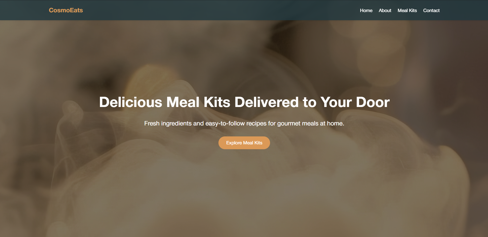

# Responsive Landing Page with Interactive Navigation 🖥️

Welcome to the **Responsive Landing Page** project! This repository showcases a modern, responsive landing page designed with an interactive navigation menu that enhances user experience through dynamic styling and seamless interactivity.

## 🚀 Project Overview

This project focuses on creating a responsive landing page with a sleek, fixed-position navigation menu. The navigation bar is always visible, providing easy access to all sections of the page. It features dynamic behavior:

- **Color & Style Change on Scroll**: The navigation bar adapts its appearance as users scroll through the page.
- **Hover Effects**: Menu items change color or style when hovered over, offering visual feedback to users.

This project is built using:
- **HTML** for structuring the content
- **CSS** for styling and making the page responsive
- **JavaScript** for adding interactivity and dynamic behavior to the navigation menu

## 🛠️ Features

- **Responsive Design**: Adapts seamlessly across different screen sizes, from mobile devices to desktops.
- **Interactive Navigation**: A fixed navigation bar that enhances user experience with color and style changes on scroll and hover.
- **Smooth Scrolling**: Links smoothly transition users to different sections of the landing page.

## 📂 Project Structure
```graphql
├── index.html # Main HTML file
├── styles.css # CSS file for styling
├── script.js # JavaScript file for interactivity
└── img/ # Folder for images, icons, and other assets
```

## 🔧 Installation

1. Clone the repository to your local machine:
git clone https://github.com/Mayur-Mhatre/PRODIGY_WD_01.git

2. Navigate to the project directory:
cd responsive-landing-page

3. Open `index.html` in your preferred web browser.

## 🌟 How It Works

- **HTML**: Structures the layout of the landing page.
- **CSS**: Handles the design and responsiveness, ensuring the page looks good on all devices.
- **JavaScript**: Adds interactivity, including the dynamic behavior of the navigation menu.

## 📸 Screenshots



## 📝 License

This project is licensed under the GNU General Public License v3.0 License. See the [LICENSE](LICENSE) file for details.

## 🙌 Acknowledgements

- Inspired by modern web design principles and interactive user interfaces.
- Special thanks to Prodigy Infotech for the project idea.

## 👤 Author

**Mayur Mhatre**

- GitHub: [@Mayur-Mhatre](https://github.com/Mayur-Mhatre/)
- LinkedIn: [@MayurMhatre](https://www.linkedin.com/in/mayurmhatre/)

---

Feel free to contribute, report issues, or suggest improvements!

